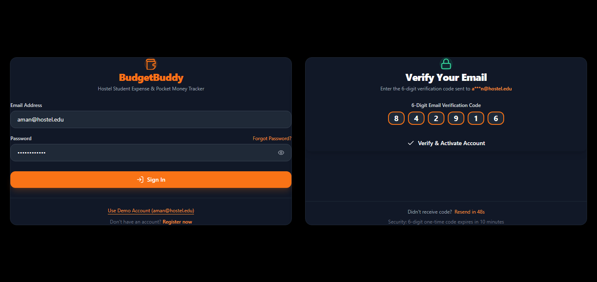
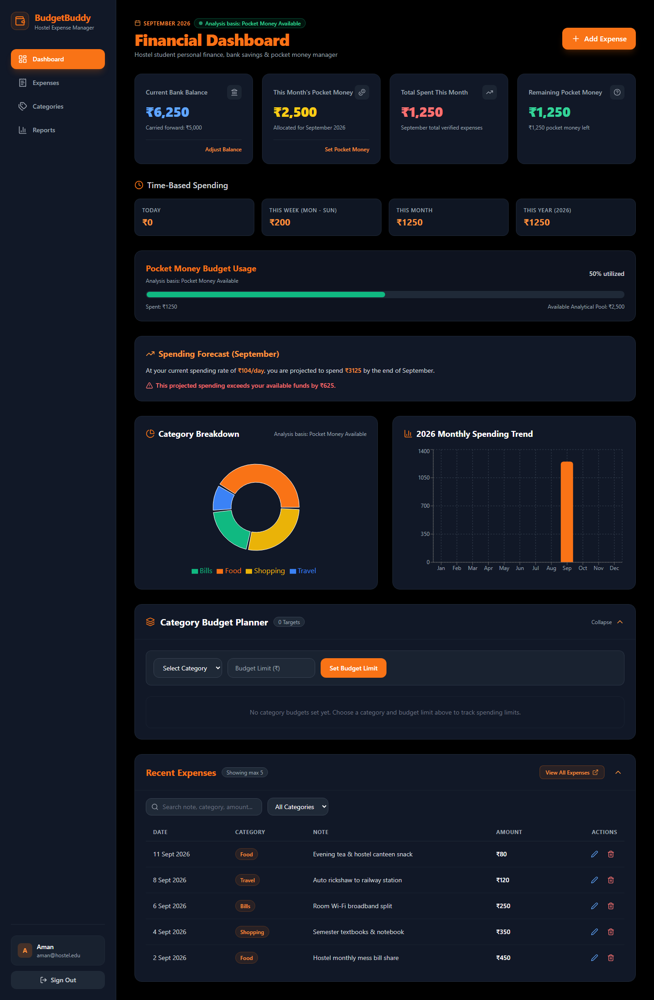
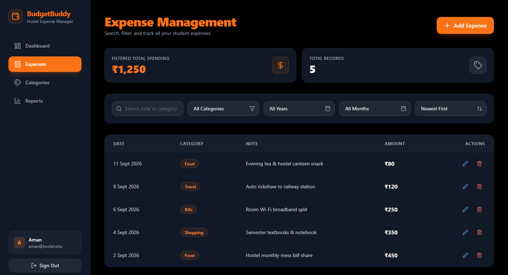
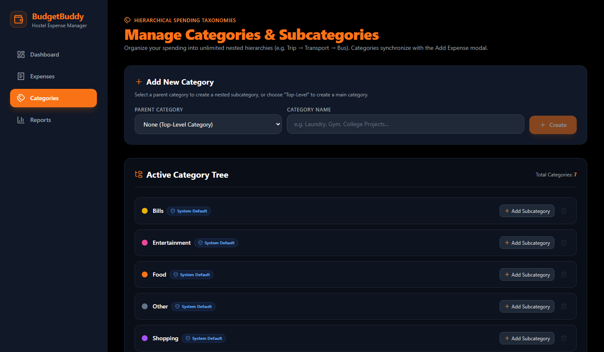
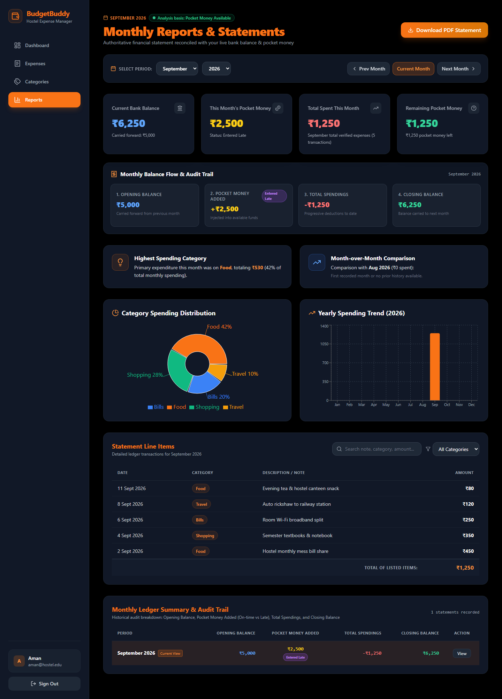
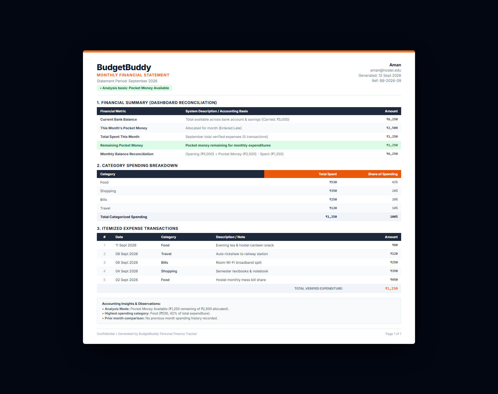

# BudgetBuddy

> A modern, full-stack personal finance and pocket-money management web application tailored for hostel and college students.

BudgetBuddy is a full-stack MERN application engineered to solve the real-world financial challenges faced by students living in hostels and university accommodations. Managing personal finances in a hostel environment requires balancing irregular pocket money transfers from parents, recurring monthly living costs, unexpected campus expenses, and maintaining a reliable bank balance buffer without overdrafting.

Traditional budgeting tools are overly complex, enterprise-focused, or assume fixed monthly corporate salaries. BudgetBuddy introduces a student-centric financial ledger model featuring dual-mode analytics (Pocket Money tracking vs. Total Bank Balance protection), hierarchical expense categorization, date-restricted entry validation, and automated PDF statement generation.

---

## 1. Project Preview

```
docs/screenshots/
├── login.png                 # Sign In & 6-Digit Email OTP Verification
├── dashboard.png             # Live Financial Ledger Cards & Analytics Mode
├── expenses.png              # Expense Ledger with search, sorting & category filtering
├── categories.png            # Multi-level category hierarchy & management
├── reports.png               # Monthly statements, audit trail & Recharts visualizations
└── financial-statement.png   # Printable A4 PDF statement generated client-side
```

### Preview Gallery

| Authentication & Verification | Dashboard Overview |
| :---: | :---: |
|  |  |
| *Secure authentication with 6-digit email OTP* | *Authoritative bank balance & pocket money tracking* |

| Expense Ledger & Filtering | Category Hierarchy |
| :---: | :---: |
|  |  |
| *Real-time search, date controls & overspending guard* | *Protected default categories with custom subcategories* |

| Financial Reports & Analytics | PDF Financial Statement |
| :---: | :---: |
|  |  |
| *Interactive category distribution & monthly audit trail* | *Executive-grade A4 printable financial statement* |

---

## 2. Key Features

- **Robust Authentication & Account Security**:
  - Secure registration requiring full name, valid email, and password confirmation.
  - Mandatory 6-digit email OTP verification via Nodemailer SMTP with 60-second resend cooldowns and attempt rate-limiting.
  - Secure JWT session management (30-day expiry) with token validation on protected client routes.
  - Cryptographically secure single-use password reset links sent via email with expiration handling and account enumeration protection.

- **Student-Centric Dual-Mode Financial Accounting**:
  - **Current Bank Balance**: Authoritative live balance representing actual funds across bank accounts and savings.
  - **This Month's Pocket Money**: Discretionary funds allocated for the current calendar month that dynamically credit to your balance upon entry.
  - **Dynamic Analytics Mode Switching**:
    - **Pocket Money Mode**: When pocket money is available, spending is analyzed against your monthly allowance.
    - **Total Bank Balance Mode**: When pocket money is exhausted (or pending), the system automatically displays an exhaustion notification and shifts analytics to your total bank balance.
    - **Overspending Prevention**: Strictly blocks expenses that exceed your total available bank balance, preventing negative funds.

- **Intelligent Calendar & Transaction Controls**:
  - Automatically syncs with the active calendar month.
  - Strict validation preventing future-dated expense entries.
  - Carried-forward opening balances across month boundaries so unspent funds are never lost.

- **Hierarchical Category Management**:
  - Seeded default categories (`Food`, `Travel`, `Shopping`, `Bills`, `Entertainment`, `Other`) protected against deletion.
  - Support for custom multi-level nested categories (e.g., `Trip` &rarr; `Transport` &rarr; `Flight`).
  - Safe category deletion that prevents deleting categories or parent categories that contain active transactions.

- **Searchable Expense Ledger**:
  - Real-time search across expense notes, categories, and amounts.
  - Filter by category, year, and month.
  - Sorting by newest, oldest, highest amount, and lowest amount.
  - Full edit and delete capabilities with automatic balance recalculation.

- **Audit Trails & Visual Reporting**:
  - Visual category distribution donut charts and 12-month spending trend bar charts powered by Recharts.
  - "Monthly Ledger Summary & Audit Trail" table tracking opening balances, pocket money status, monthly spendings, and closing balances.
  - One-click navigation to dedicated monthly statements (`/reports/:year/:month`).

- **Official Financial Statement PDF Generation**:
  - Built-in, high-fidelity printable A4 PDF statement generator using `jsPDF` and `jspdf-autotable`.
  - Includes institutional branding, reference numbers, active analysis mode badges, category breakdowns, and verified line-item transaction tables.

---

## 3. Tech Stack

### Frontend
- **Framework**: [React 19](https://react.dev/)
- **Build Tool**: [Vite 7](https://vite.dev/)
- **Routing**: [React Router v7](https://reactrouter.com/) (BrowserRouter, Protected Routes, Dynamic Parameters)
- **Styling**: [Tailwind CSS v3](https://tailwindcss.com/)
- **Icons**: [Lucide React](https://lucide.dev/)
- **Charts & Visualizations**: [Recharts v3](https://recharts.org/)
- **Client-Side PDF Generation**: [jsPDF](https://github.com/parallax/jsPDF) & [jspdf-autotable](https://github.com/simonbengtsson/jsPDF-AutoTable)

### Backend
- **Runtime**: [Node.js](https://nodejs.org/) (v20+ / v24 compatible)
- **Web Framework**: [Express.js 5](https://expressjs.com/)
- **Database ORM**: [Mongoose 9](https://mongoosejs.com/)
- **Authentication**: [jsonwebtoken (JWT)](https://github.com/auth0/node-jsonwebtoken) & [bcryptjs](https://github.com/dcodeIO/bcrypt.js)
- **Email Delivery**: [Nodemailer](https://nodemailer.com/) (Configured for Gmail SMTP / TLS)
- **Security & Utilities**: CORS, Dotenv, Node.js Crypto

### Database
- **Database**: [MongoDB Atlas](https://www.mongodb.com/atlas) (Cloud cluster with replica sets)
- **Local Fallback**: Built-in document storage engine (`local_db.json`) for seamless offline local development

---

## 4. Application Screens

1. **Authentication (`/login`, `/register`, `/forgot-password`, `/reset-password`)**:
   - Clean dark-mode login form with password visibility toggle.
   - Quick one-click demo credentials button for instant testing.
   - Registration flow with instant email OTP delivery and single-use activation.
   - Secure forgot password workflow with email-delivered reset tokens.

2. **Dashboard (`/`)**:
   - The primary command center. Displays 4 key metric cards: Current Bank Balance, This Month's Pocket Money, Total Spent This Month, and Remaining Pocket Money.
   - Live analytics status banner indicating whether analysis is currently based on Pocket Money Available or Total Bank Balance.
   - Quick expense recording modal and recent transactions overview (capped at 10 items).

3. **Expenses (`/expenses`)**:
   - Comprehensive transaction ledger. Features instant keyword search, category dropdown filtering, month/year selectors, and column sorting.
   - Modal to add new expenses with amount, date, category, and optional notes.
   - Real-time balance adjustment upon adding, editing, or deleting entries.

4. **Categories (`/categories`)**:
   - Management page for default and custom spending categories.
   - Color picker, icon selector, and parent category selection for hierarchical subcategories.
   - Transaction count badges and deletion protections for categories in use.

5. **Reports (`/reports`)**:
   - Comprehensive overview containing interactive spending trend charts, category distribution pies, and a historical audit trail table.
   - "View" buttons route directly to dedicated monthly statements.

6. **Dedicated Month Report & PDF (`/reports/:year/:month`)**:
   - Detailed ledger statement for any selected historical or current calendar month.
   - Reconciled against live bank balance and verified transactions.
   - One-click "Download PDF" button that generates a formatted A4 document ready for printing or sharing.

---

## 5. Project Structure

```text
Budgetbuddy/
├── frontend/
│   ├── public/
│   ├── src/
│   │   ├── components/
│   │   │   ├── DashboardCard.jsx       # Reusable financial metric cards
│   │   │   ├── ExpenseModal.jsx        # Modal for adding/editing expenses
│   │   │   ├── InitialBalanceModal.jsx # First-time onboarding balance modal
│   │   │   ├── PasswordInput.jsx       # Secure password input with eye toggle
│   │   │   ├── PocketMoneyModal.jsx    # Monthly pocket money entry modal
│   │   │   ├── ProtectedRoute.jsx      # Authentication route guard
│   │   │   ├── SalaryModal.jsx         # Base income/salary configuration modal
│   │   │   └── Sidebar.jsx             # Main navigation sidebar & user badge
│   │   ├── context/
│   │   │   ├── AuthContext.jsx         # User authentication & session provider
│   │   │   ├── authContextDefinition.js# React context definition
│   │   │   └── useAuth.js              # Custom hook for consuming auth state
│   │   ├── pages/
│   │   │   ├── Categories.jsx          # Category management & hierarchy page
│   │   │   ├── Dashboard.jsx           # Live financial command center
│   │   │   ├── Expenses.jsx            # Itemized expense ledger with filters
│   │   │   ├── ForgotPassword.jsx      # Password reset request page
│   │   │   ├── Login.jsx               # Sign In page with demo account fill
│   │   │   ├── MonthReport.jsx         # Detailed monthly financial statement
│   │   │   ├── Register.jsx            # Account registration & OTP activation
│   │   │   ├── Reports.jsx             # Reports overview & audit trail
│   │   │   └── ResetPassword.jsx       # Token-verified password reset page
│   │   ├── services/
│   │   │   └── api.js                  # Centralized fetch API client with timeout
│   │   ├── utils/
│   │   │   └── reportPdfGenerator.js   # Client-side jsPDF A4 statement engine
│   │   ├── App.jsx                     # Route declarations
│   │   ├── main.jsx                    # React DOM entrypoint
│   │   └── index.css                   # Tailwind CSS configuration & styling
│   ├── .env.example
│   ├── index.html
│   ├── package.json
│   ├── tailwind.config.js
│   └── vite.config.js
│
├── backend/
│   ├── config/
│   │   ├── db.js                       # Mongoose connection manager with DNS resolver
│   │   └── store.js                    # Storage layer coordinator & offline fallback
│   ├── controllers/
│   │   ├── authController.js           # Auth, OTP, tokens & onboarding
│   │   ├── budgetController.js         # Category budget limit handlers
│   │   ├── categoryController.js       # Hierarchical category management
│   │   ├── dashboardController.js      # Authoritative financial summary logic
│   │   ├── expenseController.js        # Transaction CRUD & balance validation
│   │   ├── monthlyRecordController.js  # Monthly pocket money & carried balance
│   │   └── reportController.js         # Historical statements & audit trail
│   ├── data/
│   │   └── .gitkeep                    # Directory anchor (data files git-ignored)
│   ├── middleware/
│   │   └── auth.js                     # JWT authorization bearer middleware
│   ├── models/
│   │   ├── Budget.js                   # Category budget schema
│   │   ├── Category.js                 # Hierarchical category schema
│   │   ├── Expense.js                  # Expense transaction schema
│   │   ├── MonthlyRecord.js            # Monthly pocket money & ledger schema
│   │   └── User.js                     # User profile, credentials & balance schema
│   ├── routes/
│   │   ├── authRoutes.js
│   │   ├── budgetRoutes.js
│   │   ├── categoryRoutes.js
│   │   ├── dashboardRoutes.js
│   │   ├── expenseRoutes.js
│   │   ├── monthlyRecordRoutes.js
│   │   └── reportRoutes.js
│   ├── services/
│   │   ├── emailService.js             # Nodemailer SMTP transporter & templates
│   │   └── storageService.js           # High-level database abstraction service
│   ├── test_email.js                   # SMTP connection diagnostics script
│   ├── verify_budgetbuddy.js           # 42-assertion automated end-to-end test suite
│   ├── .env.example
│   ├── package.json
│   └── server.js                       # Express app bootstrap & error handlers
│
├── docs/
│   └── screenshots/                    # Application preview images
├── .gitignore
└── README.md
```

---

## 6. Installation & Setup

### Prerequisites
- [Node.js](https://nodejs.org/) (version 20 or higher recommended)
- [npm](https://www.npmjs.com/)
- [MongoDB Atlas](https://www.mongodb.com/atlas) account (or local MongoDB running on `mongodb://127.0.0.1:27017`)
- Gmail account with an [App Password](https://myaccount.google.com/apppasswords) (for real email OTPs)

### 1. Clone the Repository
```bash
git clone https://github.com/psprashanth25/budgetbuddy.git
cd budgetbuddy
```

### 2. Configure Backend Environment
Navigate to the `backend/` directory and create your `.env` file:
```bash
cd backend
cp .env.example .env
```
Edit `backend/.env` with your actual configuration:
```env
PORT=5000
MONGO_URI=mongodb+srv://<username>:<password>@cluster0.mongodb.net/budgetbuddy
JWT_SECRET=your_super_secret_random_jwt_key_here
CLIENT_URL=http://localhost:5173

# Outbound Email Delivery (Nodemailer SMTP)
EMAIL_HOST=smtp.gmail.com
EMAIL_PORT=587
EMAIL_SECURE=false
EMAIL_USER=your_email@gmail.com
EMAIL_PASS=your_16_digit_gmail_app_password
EMAIL_FROM="BudgetBuddy" <your_email@gmail.com>
```

### 3. Install Backend Dependencies & Start Server
```bash
npm install
npm run dev
```
The backend will initialize on `http://localhost:5000`.

### 4. Configure Frontend Environment
In a new terminal, navigate to the `frontend/` directory:
```bash
cd ../frontend
cp .env.example .env
```
Ensure `VITE_API_URL` points to your backend:
```env
VITE_API_URL=http://localhost:5000/api
```

### 5. Install Frontend Dependencies & Start Dev Server
```bash
npm install
npm run dev
```
The frontend application will start on `http://localhost:5173`. Open this URL in your web browser.

---

## 7. Environment Variables Reference

| Variable | Description | Location | Default / Example |
| :--- | :--- | :--- | :--- |
| `PORT` | Backend server port | `backend/.env` | `5000` |
| `MONGO_URI` | MongoDB Atlas or local connection string | `backend/.env` | `mongodb://127.0.0.1:27017/budgetbuddy` |
| `JWT_SECRET` | Secret key used to sign and verify JWTs | `backend/.env` | `budgetbuddy_super_secret_jwt_key_2026` |
| `CLIENT_URL` | Allowed frontend origin for CORS | `backend/.env` | `http://localhost:5173` |
| `EMAIL_HOST` | SMTP server hostname | `backend/.env` | `smtp.gmail.com` |
| `EMAIL_PORT` | SMTP port (587 for TLS, 465 for SSL) | `backend/.env` | `587` |
| `EMAIL_SECURE` | Set `true` for port 465, `false` for 587 | `backend/.env` | `false` |
| `EMAIL_USER` | Email address used for outbound messages | `backend/.env` | `your_email@gmail.com` |
| `EMAIL_PASS` | 16-character Google App Password | `backend/.env` | `abcd efgh ijkl mnop` |
| `EMAIL_FROM` | Sender display name and address | `backend/.env` | `"BudgetBuddy" <your_email@gmail.com>` |
| `VITE_API_URL` | Frontend API base URL | `frontend/.env` | `http://localhost:5000/api` |

> **Security Reminder**: Real credentials must only be stored in `.env` files. Both `backend/.env` and `frontend/.env` are strictly excluded from Git tracking via `.gitignore`.

---

## 8. Application Walkthrough & Usage Flow

1. **Sign Up & Account Activation**:
   - Register at `/register`. An outbound 6-digit OTP is delivered to your email.
   - Enter the code to activate your account.
2. **Onboarding Setup**:
   - Configure your initial Current Bank Balance (funds currently in your bank/cash).
3. **Monthly Pocket Money Allocation**:
   - When a new month begins, enter that month's pocket money. The entered amount credits directly to your bank balance.
4. **Recording Expenses**:
   - Record daily transactions under categories like Food, Travel, or Books.
   - The system checks available funds, deducts from your bank balance, and updates analytics.
5. **Monitoring Financial Health**:
   - View your Dashboard to track pocket money usage and check whether your analysis basis is in Pocket Money mode or Total Bank Balance mode.
6. **Generating Reports & Statements**:
   - Open `/reports` to inspect the historical audit trail.
   - Click **View** on any month to examine the detailed breakdown or click **Download PDF** to export an official statement.

---

## 9. Security Implementation

- **Password Hashing**: Passwords are encrypted using `bcryptjs` with auto-generated salt rounds before database persistence.
- **Cryptographic OTPs & Tokens**: Verification codes and password reset tokens use Node.js `crypto` with SHA-256 hashing. Cleartext tokens are never stored in the database.
- **Token Invalidation & Expiry**: Password reset tokens and OTP codes have strict expiration windows and are invalidated immediately upon first use to prevent replay attacks.
- **Rate-Limiting & Cooldowns**: Resend OTP endpoints enforce a 60-second cooldown period, and verification attempts are capped at 5 tries.
- **JWT Authorization**: Sensitive REST API routes require an `Authorization: Bearer <token>` header verified via Express middleware.
- **Strict Data Isolation**: Every database query is keyed by `userId`, ensuring complete privacy and isolation between student accounts.
- **CORS Protection**: Access is restricted to trusted origins defined in `CLIENT_URL`.

---

## 10. Verification & Automated Testing

BudgetBuddy includes a comprehensive 42-point automated verification suite testing all core functionality end-to-end:

```bash
cd backend
node verify_budgetbuddy.js
```

### Verified Scenarios
- Genuine MongoDB Atlas connectivity.
- Registration field validation and password matching.
- Real-time OTP generation, email dispatch, attempt limits, and activation.
- Password reset link generation, secure single-use token consumption, and invalid token rejection.
- Initial bank balance onboarding and overspending protection.
- Date restrictions blocking future-dated transactions.
- Hierarchical categories (top-level, nested subcategories, and active expense deletion locks).
- Dual analytics mode switching (Pocket Money Mode &rarr; Bank Balance Mode on exhaustion &rarr; Reversion on replenishment).
- Dynamic balance adjustment upon editing or deleting expenses.
- 10-item cap on dashboard recent expenses while retaining full history in the dedicated expense ledger.

---

## 11. Application Preview Reference

The GitHub README preview gallery showcases 6 high-resolution production views captured directly from the live application:
- `login.png`: Dual-panel showcase featuring dark-theme credential sign-in and 6-digit email OTP verification.
- `dashboard.png`: Full financial command center displaying real-time bank balance, pocket money metrics, spending forecasts, Recharts visualizations, and recent transactions.
- `expenses.png`: Searchable student expense ledger with instant category filtering, sorting controls, and inline actions.
- `categories.png`: Hierarchical category management displaying default protected taxonomies and custom subcategory trees.
- `reports.png`: Comprehensive monthly report view with category donut distributions, 12-month spending trends, statement line items, and the historical monthly audit trail.
- `financial-statement.png`: Executive-grade A4 financial statement document reconciled against live bank balance and verified transactions, ready for printing.

---

## 12. Future Improvements

- **SMS / WhatsApp Alerts**: Optional low-balance notifications when pocket money reaches < 15%.
- **Receipt Image Attachment**: Ability to upload photo receipts for hostel mess and canteen bills.
- **Splitwise-Style Roommate Splitting**: Shared hostel room bill splitting for electricity, Wi-Fi, and groceries.
- **Multi-Currency Support**: Extended localization for international students studying abroad.

---

## 13. Author

**P. S. Prashanth**  
- **GitHub**: [github.com/psprashanth25](https://github.com/psprashanth25)  
- **Project Repository**: [BudgetBuddy](https://github.com/psprashanth25/budgetbuddy)

---

## 14. License

This project is licensed under the [ISC License](LICENSE).